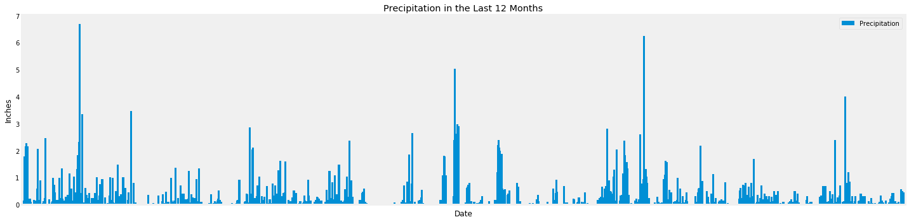
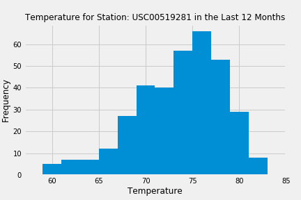

# Climate SQL-Alchemy Project

## Background
Exploring the climate and analyzing precipitation, temperature, and the stations to plan for a fictional trip in Hawaii.

### Task
#### Step 1: Climate Analysis and Exploration
* Using SQLAlchemy ORM queries, Pandas, and Matplotlib, first:
  * Specify the start date and end date for the trip (Range is approximately 3-15 days total)
  * Use SQLAlchemy create_engine to connect to your sqlite database.
  * Use SQLAlchemy automap_base() to reflect the tables into classes and save a reference to those classes called Station and Measurement.
  
* Preciptitation Analysis:
  * Design a query to retrieve the last 12 months of precipitation data.
  * Select only the date and prcp values.
  * Load the query results into a Pandas DataFrame and set the index to the date column.
  * Sort the DataFrame values by date.
  * Plot the results using the DataFrame plot method.
    
  * Use Pandas to print the summary statistics for the precipitation data.
  
* Station Analysis:
  * Design a query to calculate the total number of stations.
  * Design a query to find the most active stations.
  * List the stations and observation counts in descending order.
  * Design a query to retrieve the last 12 months of temperature observation data (TOBS).
   - Filter by the station with the highest number of observations.
   - Plot the results as a histogram with bins=12.
    
    

#### Step 2: Climate App
* Design a Flask API based on the queries developed prior
  * Use Flask to create routes
  `/` - Home page: List all routes that are available.
  `/api/v1.0/precipitation` - Convert the query results to a dictionary using date as the key and prcp as the value. Return the JSON representation of your   dictionary.
  `/api/v1.0/stations` - Return a JSON list of stations from the dataset.
  `/api/v1.0/tobs` - Query the dates and temperature observations of the most active station for the last year of data. Return a JSON list of temperature observations (TOBS) for the previous year.
  `/api/v1.0/<start> and /api/v1.0/<start>/<end>` - Return a JSON list of the minimum temperature, the average temperature, and the max temperature for a given start or start-end range. When given the start only, calculate TMIN, TAVG, and TMAX for all dates greater than and equal to the start date. When given the start and the end date, calculate the TMIN, TAVG, and TMAX for dates between the start and end date inclusive.

